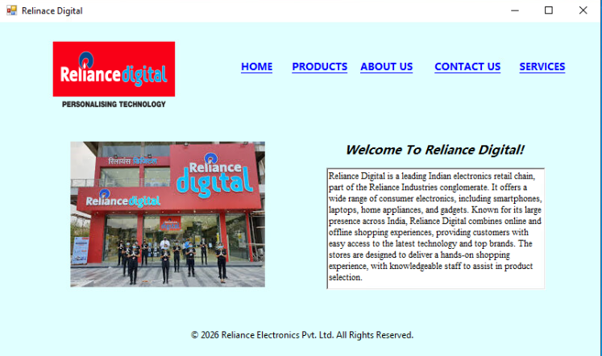
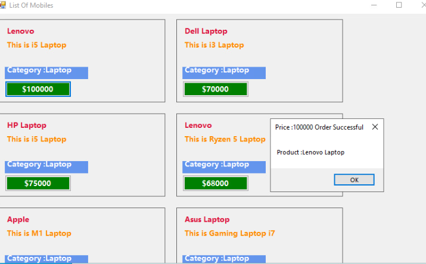
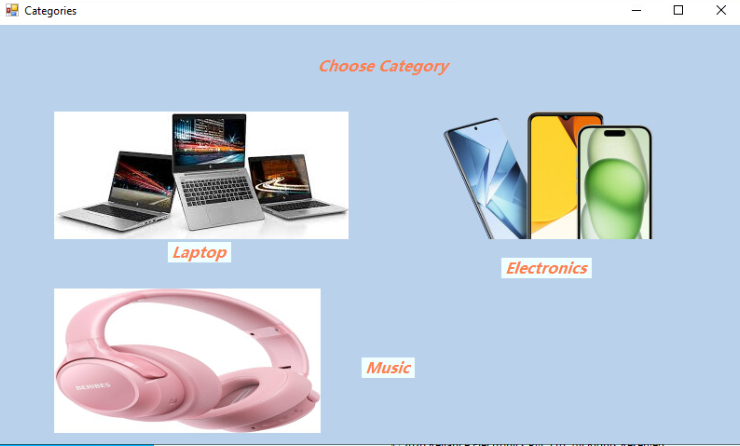
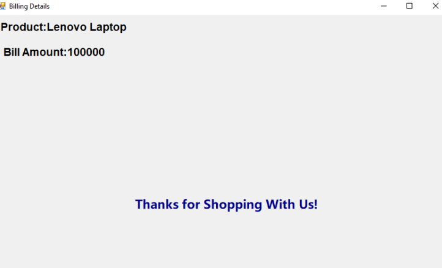
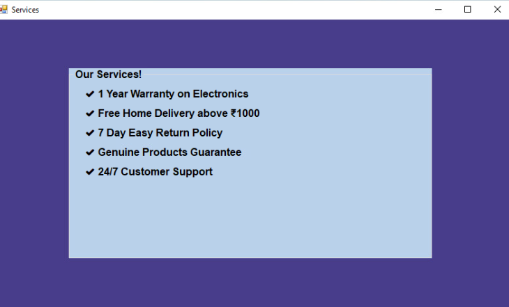
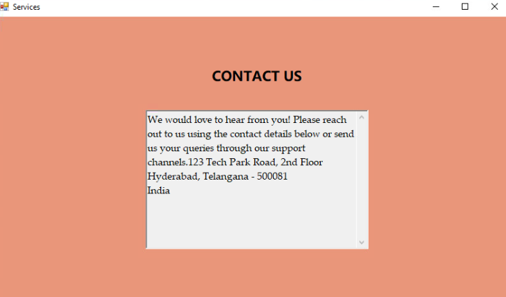
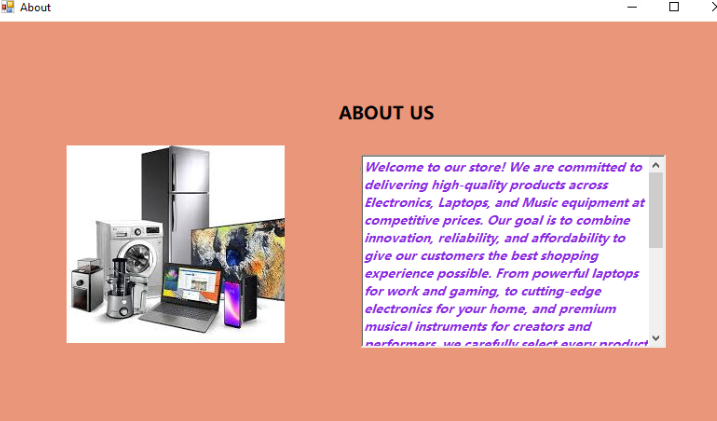

# 🏢 Reliance Store Management App
### 💻 Developed using C# & WinForms


> 🚀 A Windows Desktop Application built using **C#** and **Windows Forms (WinForms)** that simulates a product-based store system with categorized search, services information, and company details.

---

## 📖 Project Description

**Reliance Store Management App** is designed to provide a smooth desktop experience for managing and browsing products.  
The application includes category-based optimized search, company policies, and easy navigation across multiple pages.

---

## 🧰 Tech Stack

| Technology | Purpose |
|---|---|
| 💻 C# | Core programming language |
| 🪟 Windows Forms (WinForms) | UI Framework |
| 🗄️ ADO.NET | Database connectivity |
| 🛢️ SQL Server | Database |

---

## ✨ Features

### 🏠 Home Page
- 📄 Application description
- 🔗 Navigation links to other pages
- 📊 Dashboard-style interface



### 🛍️ Products Page
- 📦 Displays product details:
  - Product ID
  - Product Name
  - Description
  - Price
  - Category
- ⚡ Dynamic data loading from database



### 🔎 Category Optimized Search
- 🔎 **Category Optimized Search** (Single Query)
- 📂 Available Categories:
  - 💻 Laptop
  - 📱 Mobile
  - 🎵 Music



### 🧾 Bill
- 🧾 Auto-generated billing for selected products
- 💰 Displays itemized product costs and total amount



### 🛠️ Services Page
- 📜 Store policies
- 🔄 Return & refund policy
- 📋 Terms and conditions
- 🤝 Customer guidelines



### 📞 Contact Page
- 📧 Email details
- ☎️ Support information
- 📍 Company contact details



### ℹ️ About Us Page
- 🏢 Company background
- 🎯 Mission & Vision
- 🌟 Organizational values



---

## 📊 Database Schema

### Table: `Product`

| Column | Type | Constraint |
|---|---|---|
| `pid` | int | Primary Key |
| `pname` | varchar | — |
| `pdesc` | varchar | — |
| `price` | decimal | — |
| `category` | varchar | — |

---

## 💡 Optimized Category Search Query

```sql
SELECT * FROM Product
WHERE (@category IS NULL OR category = @category);
